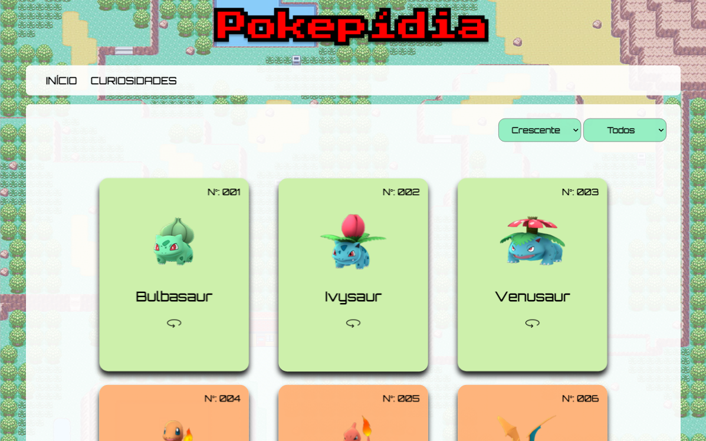
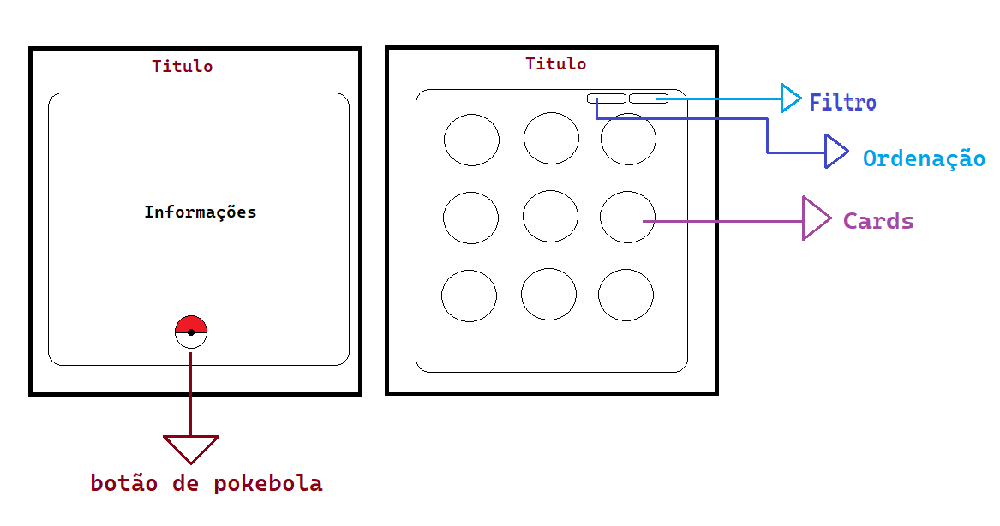
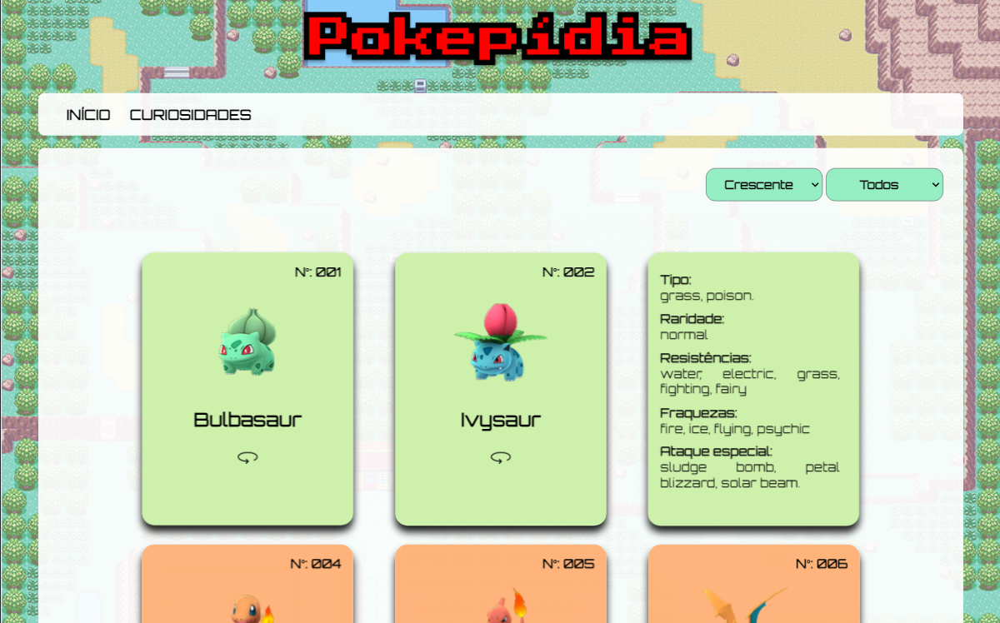
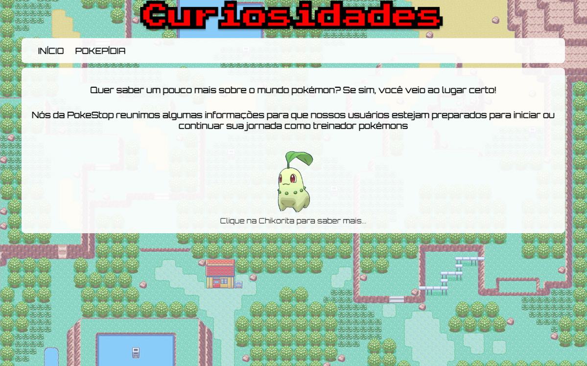

# [Data Lovers — PokeStop](https://catarinaeudoxia.github.io/SAP010-data-lovers/)

## Índice

* [1. Prelúdio](#1-prelúdio)
* [2. Visão geral do projeto](#2-visão-geral-do-projeto)
* [3. Objetivos](#3-objetivos)
* [4. Protótipos](#4-protótipos)
* [5. Critérios de aceitação e hacker edition alcançados](#5-critérios-de-aceitação-e-hacker-edition-alcançados)
* [6. Ferramentas e mecanismos usados](#6-ferramentas-e-mecanismos-usados)
* [7. Checklist](#7-checklist)
* [8. PokeStop aqui](#8-pokestop-aqui)
* [9. Projeto desenvolvido por](#9-projeto-desenvolvido-por)

 

 

# 1. Prelúdio

 O projeto Data Lovers foi elaborado com o propósito de aprimorar nossas habilidades e aplicar os conhecimentos adquiridos durante o bootcamp da Laboratória. Nosso principal objetivo foi explorar e utilizar diversas técnicas, como filtragem, ordenação, cálculo agregado, desenvolvimento de testes e trabalho colaborativo no GitHub. Tudo isso foi realizado a partir de um arquivo de dados fornecido pela Laboratória, proporcionando uma experiência prática e enriquecedora. 

 

# 2. Visão geral do projeto

 Em nosso emocionante projeto, fomos apresentados a uma variedade de temas interessantes, cada um deles contendo uma base de dados rica em informações valiosas, como nomes, números, tipos e muito mais. Essa base de dados foi estruturada em um array contendo diversos objetos específicos.

 Com determinação e dedicação, aprendemos a trabalhar com o acesso aos objetos, utilizando funções, parâmetros, map, filter, sort e cálculo agregado. Além disso, mergulhamos no mundo do Git colaborativo, onde pudemos trabalhar em equipe e aprender com cada passo dado.

 No meio de tantos temas interessantes, escolhemos explorar o universo Pokémon, que nos presenteou com uma base de dados contendo 251 criaturas da região de Kanto. Nosso foco era trazer essas informações para os jogadores e aspirantes a treinadores, permitindo que eles mergulhassem no mundo dos Pokémons.

 Nosso objetivo era desenvolver uma interface intuitiva e cativante, onde as pessoas pudessem desfrutar das informações detalhadas sobre cada Pokémon. Através dela, seria possível explorar características como números, nomes, tipos, resistências, fraquezas e ataques especiais. Além disso, implementamos a capacidade de aplicar filtros por tipo e realizar ordenações numéricas ou alfabéticas, para oferecer uma experiência personalizada.

 Embora sejamos iniciantes na programação, estamos animados para compartilhar os resultados de nossos esforços. Buscamos criar uma experiência envolvente, despertando a curiosidade e a paixão pelos Pokémons. Queremos que todos possam se divertir ao explorar as características de cada criatura, conectar pessoas apaixonadas por esse mundo e oferecer uma interface interativa que proporciona uma imersão única. 

 Estamos empolgadas para tê-lo(a) ao nosso lado nessa incrível jornada como programadoras em desenvolvimento!  

 

# 3. Objetivos
  O projeto possui um objetivo principal e objetivos opcionais que podem ser escolhidos para guiar nossa estratégia de trabalho. Confira abaixo:
 

## Objetivo Principal:

* Desenhar e construir uma interface web que permita visualizar e manipular dados, levando em consideração as necessidades do usuário. 

 

## Objetivos Opcionais:

*  Desenvolver uma interface web que permita visualizar e manipular os dados da base de dados.
*  Utilizar habilidades em HTML, CSS e JavaScript para criar uma interface atraente e funcional.
*  Aplicar técnicas como map, filter, sort e cálculo agregado para acessar e manipular os objetos da base de dados.
*  Trabalhar com funções, parâmetros de funções e manipulação dinâmica do DOM.
*  Utilizar Git colaborativo para o controle de versões e trabalho em equipe.
*  Construir testes unitários para garantir a qualidade do código.

 

# 4. Histórias do Usuário
* **Quem são os usuários principais do produto Pokestop?**
 Os usuários principais do produto Pokestop são jogadores de Pokémon Go e amantes do universo pokémon, que têm interesse em consultar informações sobre os diversos pokémons existentes na região de Kanto.

* **Quais são os objetivos dos usuários com relação ao produto Pokestop?** 
O objetivo dos usuários com relação ao produto Pokestop é obter informações detalhadas sobre os pokémons, além de descobrir curiosidades a respeito desse universo, como as diferentes pokébolas de captura.

* **Quais são os dados mais relevantes que os usuários desejam ver na interface do Pokestop e por quê?**
A interface do Pokestop exibe os dados mais relevantes que os usuários desejam visualizar. Esses dados incluem o nome, a imagem, o número, o tipo, a raridade, as resistências, as fraquezas e os ataques especiais de cada Pokémon. É importante ressaltar o destaque dado às resistências, fraquezas e raridade, pois essas informações informam a probabilidade de um usuário encontrar e capturar um Pokémon específico, além de orientar sobre quais Pokémons utilizar em batalhas, levando em consideração suas fraquezas e resistências.

* **Quando os usuários utilizam ou utilizariam o produto Pokestop?**
Os usuários utilizam o produto Pokestop quando estão na região de Kanto e precisam consultar informações sobre um pokémon desconhecido ou revisitar os dados de acordo com sua necessidade.

 

# 5. Protótipos

## — Protótipo de baixa fidelidade:

## — Testes de usabilidade:
Após a criação e início da construção do projeto, constatamos a existência de alguns problemas que não estavam alinhados com a história de usuário que pretendíamos proporcionar. Diante disso, tomamos a decisão de analisar cuidadosamente nossos erros e identificar os problemas de usabilidade, a fim de trabalhar em suas melhorias.

Identificamos os seguintes problemas:

* Insuficiência de informações fornecidas aos nossos usuários.
* Falta de responsividade do site em diferentes dispositivos.
* Aspecto pouco atrativo e interativo do projeto.

Com base nessas percepções, nos empenhamos em solucionar cada um desses desafios, visando proporcionar uma experiência mais satisfatória aos usuários.

## —  Protótipo de alta fidelidade:

## — Testes unitários:

 

# 5. Critérios de aceitação e hacker edition alcançados
 Critérios mínimos de aceitação do projeto:

* [✔] Definição de produto.

* [✔] Histórias de usuário.

* [✔] Protótipo de baixa fidelidade.

* [✔] Protótipo de alta fidelidade.

* [✔] Testes de usabilidade.

* [✔] Implementação da interface de usuário (HTML/CSS/JS).

* [✔] Testes unitários.

* [✔] 100% de cobertura nos testes.

* [✔] A interface será "implantada" usando o GitHub Pages.

* [✔] O README contém uma definição de produto.

 

# 6. Ferramentas e mecanismos usados:

— HTML

— CSS 

— JavaScript 

— VSCODE 

— Figma 

—  Canva

— Git bash 

— Node.js

— Jest

— Notion

 

# 7. Checklist

* [✔] Usar VanillaJS.
* [✔]Passa pelo linter (`npm run pretest`)
* [✔] Passa pelos testes (`npm test`)
* [✔] Testes unitários cobrem um mínimo de 70% de statements, functions, lines e branches.
* [✔] Inclui uma _definição de produto_ clara e informativa no `README.md`.
* [✔] Inclui histórias de usuário no `README.md`.
* [✔] Inclui rascunho da solução (protótipo de baixa fidelidade) no `README.md`.
* [✔] Inclui uma lista de problemas detectados nos testes de usabilidade no `README.md`.
* [✔] UI: Mostra lista/tabela/etc com dados e/ou indicadores.
* [✔] UI: Permite ordenar dados por um ou mais campos (asc e desc).
* [✔] UI: Permite filtrar dados com base em uma condição.
* [✔] UI: É _responsivo_.

 

# 8. PokeStop aqui:

### Aproveite a parada e de uma olhada na nossa [PokeStop](https://catarinaeudoxia.github.io/SAP010-data-lovers/)! 

 

# 9. Projeto desenvolvido por:
 

  <table>
    <tr>
      <td align="center">
        <a href="#">
           
          
            <b>Aline Landeira</b>
          
        </a>
      </td>
      <td align="center">
        <a href="#">
            
          
            <b>Catarina Eudoxia Ferreira</b>
          
        </a>
      </td>
      <td align="center">
        <a href="#">
           
          
            <b>Carolina Menezes</b>
          
        </a>
      </td>
    </tr>
  </table>